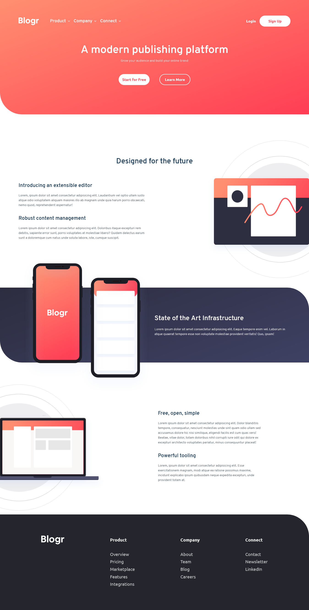

# Blogr landing page

This is a solution to the [Blogr landing page challenge on Frontend Mentor](https://www.frontendmentor.io/challenges/blogr-landing-page-EX2RLAApP).

## Table of contents

- [Screenshot](#screenshot)
- [Live site link](#link-site-URL)
- [My process](#my-process)
  - [Built with](#built-with)
- [Author](#author)

## Screenshot

## Live Site URL:

[Live demo](https://blogr-landing-page-sigma.vercel.app/)

## My process

### Built with

- Semantic HTML5 markup
- SCSS
- CSS custom properties
- Flexbox
- CSS Grid
- Mobile-first workflow

## Author

[Marcos Pennachini](https://linkedin.com/in/marcos-pennachini)
